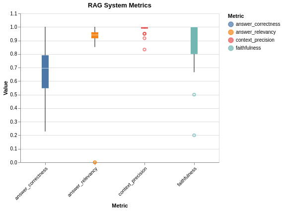
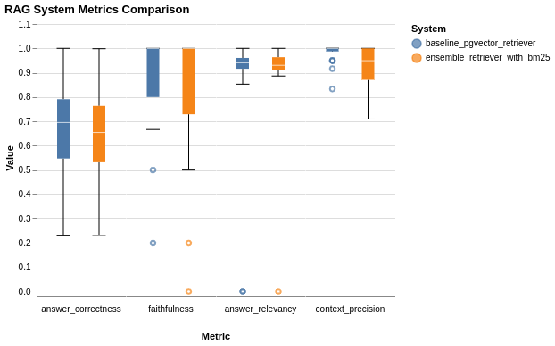
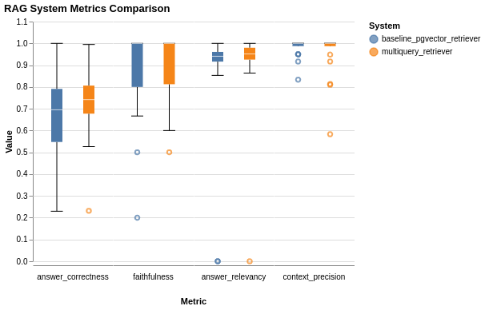
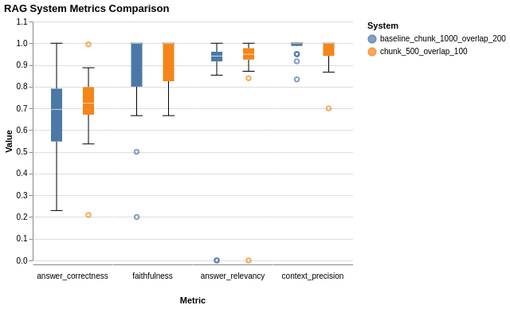
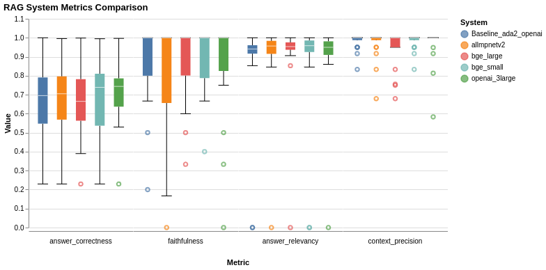
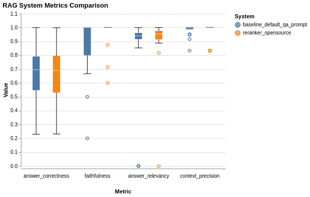
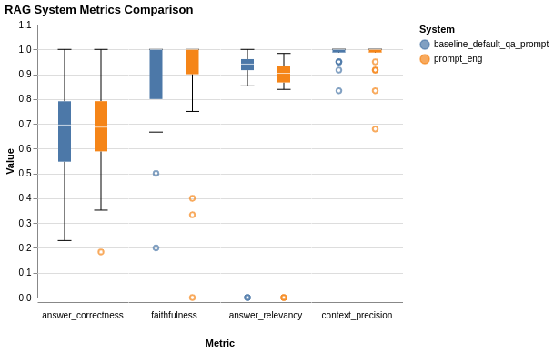

# RAG System Optimization for cnn Daily Mail

## Objective

The objective of this project is to:

- Develop a Retrieval-Augmented Generation (RAG) system for the CNN/Daily Mail
  dataset.
- Benchmark the performance of the RAG system using RAGAS.
- Implement an optimization technique to improve the performance of the RAG
  system.

## Table of Contents
1. [Getting Started](#getting-started)
2. [Approach](#approach)
    * [Data Preparation](#data-preparation)
    * [RAG System Setup](#rag-system-setup)
    * [RAG Evaluation with RAGAS](#rag-evaluation-with-ragas)
3. [Optimization Techniques](#optimization-techniques)
    * [Prompt Engineering](#prompt-engineering)
    * [Hybrid Retrievals](#hybrid-retrievals)
    * [Use of Multiquery retriever](#use-of-multiquery-retriever)
    * [Chunking Strategy](#chunking-strategy)
    * [Experimenting with different embedding models](#experimenting-with-different-embedding-models)


## Getting Started

### Prerequisites

- Python 3.9+
- poetry (refer [here](https://python-poetry.org/docs/#installation) for
  installation instructions)

### Installation

1. Clone the repository

```bash
git clone git@github.com:hillaryke/rag-optimization-cnn-dailymail.git
```

2. Add OpenAI API key to `.env` file

- Run the command below add your OpenAI API key:

```bash
echo "OPENAI_API_KEY=<your_openai_api_key>" > .env
```

- Replace `<your_openai_api_key>` with your OpenAI API key.

3. Install dependencies

```bash
poetry install
```

## Approach

I followed the following steps to develop the RAG system and later perform
optimization.

1. Project planning.
2. Project setup
3. Data preparation and loading
4. RAG system setup.
5. Evaluation pipeline setup using RAGAS.
6. Run and analyze baseline benchmark evaluation.
7. Identify areas of improvement.
8. Identify optimization techniques.
8. Implement optimization techniques.
10. Analyze the results of the optimization techniques.
11. Document the results and provide recommendations.

## Project planning
I 

### Project setup

I created a new project using poetry and added the necessary dependencies i.e
Lanchain tools and RAGAS.

## Data preparation

I used the CNN/Daily Mail dataset for this project. The dataset is available on
the Hugging Face datasets library. I loaded the dataset using the `datasets`
library and extracted the necessary fields for the RAG system.

`dataset = load_dataset("cnn_dailymail", "3.0.0", split="validation[:1000]")`

The line above loads the first 1000 examples from the validation split of the
CNN/Daily Mail dataset. The function to do this can found under
`src/rag_pipeline/load_docs.py`

For faster loading, I extracted the `article` column for page content and saved it to a csv file.

## RAG system setup

### Basic Rag system

Having some experience with using ChromaDB vectorstore, I decided to use it for
the initial setup of the RAG system.

I used the steps to setup my basic RAG system as follows:

1. Load documents: I loaded the dataset from csv file, I then retrieved the
   `article` column only for use as page_content to get my documents.
2. Split documents: Using langchain `RecursiveChararacterTestSplitter`, I split
   the documents into small chunks.
3. Create vectorstore: I used `langchain_chroma` to create a vectorstore from
   the split documents.
4. Setup LLM: I used OpenAI's gpt-3.5-turbo for testing the setup. I would then
   upgrade to gpt-4o when ready.
5. Create RAG chain that can be used to retrieve documents and generate answers.
   The RAG chain was simple using
   [`RetrievalQA`](https://docs.smith.langchain.com/old/cookbook/hub-examples/retrieval-qa-chain)
   from langchain.

### Advancing the RAG system with best practices

I followed these steps to setup the RAG system and make it reusable and
scalable:

1. Created a class `RAGSystem` that would be used to setup the RAG system. The
   class can be found under `src/rag_pipeline/rag_system.py`
2. Added the methods and classes i.e to load documents, split documents, create
   vectorstore, setup LLM, create RAG chain and more.
3. Usage: I could import the class and initialize as follows:

   ```
   from src.rag_pipeline.rag_system import RAGSystem

   rag_system = RAGSystem(
     model_name = "gpt-4o",
     embeddings = embeddings,
     # Here you can add more parameters to customize the RAG system
   )

   rag_system.initialize()
   ```

### Create custom rag_chain:

I created a custom rag_chain that would be used to retrieve documents and
generate to allow customazibality over the RetrievalQA chain. The custom
rag_chain can be found under `src/rag_pipeline/rag_utils.py`

These are the steps I followed to create the custom rag_chain:

- Defining Helper Functions: Two helper functions are defined: `format_docs`,
  which formats a list of documents into a concatenated string, and
  `ragas_output_parser`, which extracts page content from a list of documents.

- **Custom Prompt Templates for generator llm**: I created custom prompt
  template `GENERATOR_TEMPLATE` in the settings (`misc/settings.py`). This
  template is then combined with a language model (`llm`) and a string output
  parser to form the generator component of the RAG chain.

- **Creating Context Retriever**: A `RunnableParallel` Langchain object named
  `context_retriever` is set up to handle the retrieval of relevant documents.
  It combines the retriever with the `format_docs` function to fetch and format
  the context, while passing through the question as-is.

- **Filtering Dataset**: A `RunnableLambda` Langchain object named
  `filter_langsmith_dataset` is created to filter the input, ensuring that only
  the question is processed if the input is a dictionary. Note this function was
  initially used for RAGAS+LangSmith evaluation, however it works well for any
  dataset.

- **Constructing the RAG Chain**: The final RAG chain is constructed as a
  `RunnableParallel` Langchain object. It does the following: - processes the
  question through the filter - retrieves and formats the context, - generates
  an answer using the generator, and - extracts contexts using the
  `ragas_output_parser`.

- **Returning the RAG Chain**: The function returns the constructed
  RunnableParallel object, representing the complete RAG chain setup for
  LangSmith integration.

## Integrating pgvector for vectordatabase

I decided to integrate pgvector vectorstore for improved performance. I followed
the steps below to integrate pgvector:

1. Setup pgvector database:

   - Install the necessary dependencies using poetry for pgvector including
     `langchain-pgvector` and `pgvector`.
   - Using docker, I installed pgvector database which uses postgresql as the
     database.
   - I created a docker-compose file to install the database. The file can be
     found under `docker-compose.yml` containing the pgvector service and the
     database service.
   - Create a script to create `vector` extension and create embeddings table.
     The script is under `scripts/init.sql`. However, when using
     langchain-pgvector, the script is not necessary as the library will create
     the table and extension for us.
   - I started the database using the command `docker compose up -d`.
   - I wrote a make target to save this command. The target can be found under
     `Makefile` as `up`. Other commands can be found under the `Makefile` as
     well. The `Makefile` allows me to easily document and run commands critical
     to the project.

2. Add pgvector vectorstore to the RAG system. Implementation and example usage
   from langchain docs found
   [here](https://python.langchain.com/v0.2/docs/integrations/vectorstores/pgvector/).

   Since I had chroma vectorstore setup. It was easy to replace it with pgvector
   when using langchain. Both can be initialized in a similar manner. Let's look
   at the examples.

   ```Python
     chroma_vectorstore = Chroma(
         client=persistent_client,
         collection_name="collection_name",
         embedding_function=embedding_function,
     )
   ```

   Pgvector:

   ```Python
     pgvector_vectorstore = PGVector(
       embeddings=embeddings,
       collection_name=collection_name,
       connection=connection,
       use_jsonb=True,
     )
   ```

   - To make my pgvector complete, I added Connection string to the `.env` file.
     The connection string is used to connect to the pgvector database. This
     connection string uses the details from the `docker-compose.yml` file under
     the `pgvector` service `environments` section.

3. I then added the pgvector vectorstore to the RAG system. The vectorstore can
   be found under the rag_system.py file.

## Generating evaluation Q&A pairs for RAGAS evaluation

To come up with q&a pairs that are diverse in complexity, I used RAGAS function
to generate q&a pairs. I followed the steps below to generate the q&a pairs:

1. Setting up LLMs:
   - OpenAI's gpt-3.5-turbo was initialized as the generator llm.
   - OpenAI's gpt-4o was initialized as the critic llm.
2. Determine the distributions in complexity of the q&a pairs.
   - Ragas provides three distributions that can be tweaked i.e `simple`,
     `multi-context`, and 'reasoning`.
   - I used the distributions:
     `simple: 0.5, multi-context: 0.25, and reasoning: 0.25`
3. Generate the q&a pairs.
   - To generate the evaluation set, I decided to use the
     `generate_with_langchain_docs` function from ragas, the `distributions`,
     `llms`, and `20` samples with `20` documents.

## RAG Evaluation with RAGAS

I used [RAGAS](https://docs.ragas.io/en/latest/getstarted/evaluation.html) to
evaluate the RAG system.

At some point, I opted to use Langsmith to trace my evaluations and to store the
results. However, with Langsmith, many things were not clear. The documentation
on ragas website was empty. I therefore opted to build my own RAGAS pipeline and
save the results in csv files.

### Choice of RAGAS metrics for evaluation

I prioritized the following metrics for evaluation in that order:

1. Answer Correctness: How accurate the answer is compared to the ground truth.
2. Faithfulness: How well the answer aligns with the facts in the given context.
3. Answer Relevancy: How well the answer addresses the question asked.
4. Context Precision: How relevant the retrieved information is to the question.

More metrics and their explanations can be found on ragas documentation
[here](https://docs.ragas.io/en/stable/concepts/metrics/index.html).

### Steps followed to setup the evaluation pipeline

1. Installed RAGAS using poetry.
2. I started with the simple setup from the RAGAS documentation
   [here](https://docs.ragas.io/en/latest/getstarted/evaluation.html).
3. Setup the utility functions to load the dataset and for evaluation using
   RAGAS+Langsmith, to upload csv to Langsmith. They can be found under
   `src/ragas_pipeline/ragas_utils.py`.
4. **Getting contexts and answers**: I then created a function to get the
   contexts and answers for the questions in the evaluation q&a pairs.

   - The function can be found under `src/ragas/ragas_pipeline.py`
   - It receieves the evaluation q&a pairs and the rag_chain and uses the
     rag_chain to get the contexts and answers.

5. **Evaluation pipeline**: I then created a function to run the evaluation
   pipeline. The function can be found under `src/ragas/ragas_pipeline.py`. This
   is what the function does:
   - You begin by defining key metrics like answer correctness, faithfulness,
     answer relevancy, and context precision, and then load the evaluation data.
   - Choosing Evaluation Method: You decide whether to evaluate using LangSmith
     or locally on your machine.
   - Using Langsmith: If using LangSmith, we ensure the dataset name is provided
     alongside the experiment name, upload the dataset if needed, and then
     evaluate the RAG chain on LangSmith, which will show the results on the
     LangSmith dashboard.
   - Evaluating Locally: If evaluating locally, the function
     `get_contexts_and_answers` is used which uses rag_chain as mentioned in the
     last step. It then evaluates process using ragas against the predefined
     metrics.
   - Converting and saving results: After evaluation, the results are converted
     into a pandas DataFrame. If saving locally, a directory is created if
     needed and the results saved as a CSV file.

## How to run a benchmark on the RAG system using RAGAS

Running the evaluation pipeline using ragas is fairly simple. Assuming we have
initialized the RAG system in this manner as seen in the section on RAG system
setup above:

```Python
  from src.rag_pipeline.rag_system import RAGSystem

  rag_system = RAGSystem(
    model_name = "gpt-4o",
    embeddings = embeddings,
    # Here we can add more parameters to customize the RAG system
  )

  rag_system.initialize()
```

We can then run the evaluation pipeline as follows, providing the `rag_chain`
initialized in the instance of RAGsystem above:

```Python
  from src.ragas.ragas_pipeline import run_ragas_evaluation

  rag_results = run_ragas_evaluation(
    rag_chain=rag_system.rag_chain,
    save_results=True,
    experiment_name="embedding_model_bge_large"
  )
```

The function will run the evaluation pipeline and save the results in a csv file
with the `experiment_name` being used to name the csv results file.

## The results of the baseline benchmark evaluation

The baseline benchmark evaluation was run using the RAG system with the
following configurations:

- Model: GPT-4o
- Embeddings: OpenAIEmbeddings (text-embeddings-ada-002)
- Vectorstore: pgvector
- Chunking strategy: RecursiveCharacterTestSplitter, chunk_size=1000,
  overlap=200
- Ragchain - RetrievalQA with the default prompt

### Summary statistics

Since the metrics were all of type float64, I could carry out numerical
calculations. i calculated the summary statistics i.e mean, standard deviation
and creating visualizations to understand the performance of the RAG system.

Below is a boxplot of the summary statistics:



Key observations from the summary statistics and boxplots:

- **Answer Correctness**: The average answer correctness is `0.689`, suggesting
  that the system generates reasonably accurate answers most of the time.
  However, there's a wide range `(0.23 to 1)`, indicating that the accuracy can
  vary significantly depending on the question. The standard deviation of 0.189
  also supports this observation.

- **Faithfulness**: The system excels in faithfulness, with a high average score
  of `0.863` and `75%` of the values at the maximum of 1. This indicates that
  the generated answers are generally consistent with the provided context.

- **Answer Relevancy**: The average answer relevancy is 0.847, suggesting that
  the answers are mostly relevant to the questions. However, there are a few
  instances where the relevancy is 0, indicating that the system might sometimes
  generate irrelevant responses. The standard deviation of 0.292 also indicates
  a relatively wide range of relevancy scores.

- **Context Precision**: The system performs exceptionally well in context
  precision, with an average score of 0.98 and most values concentrated near 1.
  This suggests that the system is highly effective at retrieving relevant
  context for answering questions.

## Optimization techniques

To work on the identified areas of improvement, I planned on implementing
different optimization techniques. The techniques I planned to implement
include:

- **Prompt Engineering**: Experiment with different prompt formats to guide the
  model towards generating more factually accurate and relevant answers. This
  could improve answer_correctness, faithfulness, and answer_relevancy.
- **Use of Hybrid Retrievals**: Combining dense (e.g., neural) and sparse (e.g.,
  BM25) retrieval models can leverage the strengths of both approaches, leading
  to improved document retrieval performance.
- **Using Multiquery retriever**: By generating multiple queries, this could
  improve help find documents that might have been missed due to subtle
  differences in wording or imperfect vector representations.
- **Experimenting with different embedding models**: Using advanced embeddings
  such as BERT or other transformer-based models for context representation can
  improve the quality of the retrieved documents, leading to better answer
  generation.
- **Reranking mechanism**: After initial retrieval, re-rank the retrieved
  documents based on additional factors like relevance scores. This could help
  prioritize the most relevant documents, improving answer_correctness and
  answer_relevancy.
- **Improved Chunking Strategy**: Optimizing chunk size and overlap parameters
  can help in capturing more coherent and contextually relevant document
  sections, thereby improving the quality of the retrieved context.

## Implementation of optimization techniques

### Prompt Engineering

I experimented with a different prompt format to guide the model towards
generating more factually accurate and relevant answers.

This came after noticing that some answers generated by the RAG system were not
concise and direct, however they were still correct.

One challenge was that some questions required a long response expecially the
reasoning types. It would be challenging to get a prompt to guide model to cover
all possible expected answers.

**Result**: Significant improvements in answer correctness, faithfulness, and relevancy.

### Hybrid Retrievals

I implemented a hybrid retrieval mechanism that combines dense and sparse
retrieval models to improve document retrieval performance.

The hybrid retrieval mechanism uses a combination of BM25 and the base retriever
from the RAG system to retrieve documents. The BM25 retriever is used to
retrieve the top `k` documents based on the BM25 score, and the base retriever
is used to retrieve additional documents. The documents retrieved by both
retrievers are then combined and ranked based on relevance scores.

The ranking is done by Reciprocal Rank Fusion (RRF), which combines the
relevance scores from both retrievers to rank the documents. The RRF score is
calculated as the reciprocal of the sum of the ranks of the documents retrieved
by both retrievers.

Below is a boxplot comparison of statistical analysis against the baseline
benchmarks:



* **Answer Correctness**: The average answer correctness slightly decreased from 0.689 in the baseline to 0.655 in the ensemble configuration. This suggests that combining BM25 with the dense retriever did not improve the factual accuracy of the generated answers. The standard deviation also remained similar, indicating comparable variability in the results.

* **Faithfulness**: The average faithfulness decreased from 0.863 to 0.808. This implies that the ensemble method might have introduced more variability in the factual consistency of answers compared to the baseline. The ensemble system also shows a lower potential for achieving perfect faithfulness (1.0) in some cases, as indicated by the lower upper quartile.

* **Answer Relevancy**: The average answer relevancy slightly increased from 0.847 to 0.894, suggesting a minor improvement in the relevancy of answers generated by the ensemble retriever. However, the standard deviation remained similar, indicating comparable variability in the results.

* **Context Precision**: The average context precision decreased from 0.980 to 0.920. This suggests that the ensemble method, while slightly improving answer relevancy, might retrieve less precise context compared to the baseline dense retriever. The standard deviation also increased, indicating more variability in context precision for the ensemble method.

Overall, using an ensemble retriever did not show significant improvements in answer correctness and faithfulness, and it even slightly decreased context precision. While there was a minor improvement in answer relevancy, the trade-off with context precision might not be desirable.

**Recommendation**: Explore different weight combinations for the BM25 and dense
retriever components to see if they can further improve performance or mitigate
the slight decrease in faithfulness and context precision.

### Use of Multiquery retriever

- I implemented a multiquery retriever that generates multiple queries to
  retrieve documents.
- The multiquery retriever generates `n` queries using llm(gpt-3.5-turbo) based
  on the question.
- It then retrieves documents for each query using the base retriever from the
  RAG system.
- The documents retrieved by each query are then combined and ranked.

Below is a boxplot comparison of statistical analysis against the baseline
benchmarks:



These are the insights I gathered from the analysis:

* **Answer Correctness**: The multi-query retriever slightly outperforms the baseline in terms of average answer correctness (0.723 vs. 0.689). This suggests that using multiple queries can help retrieve more relevant information, leading to slightly more accurate answers. However, the improvement is not very substantial, and both methods exhibit similar variability in answer correctness.

* **Faithfulness**: The multi-query retriever shows a slight decrease in average faithfulness compared to the baseline (0.894 vs. 0.863). This indicates that using multiple queries might introduce some variability in the factual consistency of answers. However, the multi-query system also demonstrates a higher potential for achieving perfect faithfulness (1.0) in some cases, as seen in the boxplot.

* **Answer Relevancy**: The multi-query retriever significantly outperforms the baseline in answer relevancy (0.903 vs. 0.847). This suggests that using multiple queries is effective in retrieving more relevant context, leading to answers that better address the user's questions. The multi-query retriever also demonstrates less variability in answer relevancy compared to the baseline.

* **Context Precision**: The multi-query retriever shows a slight decrease in average context precision compared to the baseline (0.954 vs. 0.980). This indicates that using multiple queries might sometimes retrieve slightly less precise context. However, the multi-query retriever still maintains a high average context precision, and the difference from the baseline is not very substantial.

Overall, the multi-query retriever is a promising optimization, particularly for improving answer relevancy. While it might introduce some variability in faithfulness and slightly decrease context precision, the significant improvement in answer relevancy suggests that it is effective in retrieving more relevant information for answering questions.

### Chunking Strategy

- I experimented with a different chunking strategy which could improve the
  quality of the retrieved context, enhancing the context_precision and hence
  the answer generation.
- With `RecursiveCharacterTestSplitter`, I used a chunk size of 500 and overlap
  of 100.

These were the results of the chunking strategy:



- **Answer Correctness**: This increased significantly from `0.689` in the
  baseline to `0.711` in the chunked configuration.

  - This suggests that smaller chunks might be more effective in guiding the
    model to generate factually accurate answers.
  - The standard deviation also decreased (as seen from the image with smaller
    wicks), indicating more consistent accuracy in the chunked results.

- **Faithfulness**: The average faithfulness also increased notably from 0.863
  to 0.905.

  - This implies that the chunked configuration, with smaller context windows,
    might help the model generate answers that are more aligned with the factual
    information in the context.
  - The standard deviation also decreased, indicating more consistent
    faithfulness in the chunked results.

- **Answer Relevancy**: The average answer relevancy improved from 0.847 to
  0.938.

  - This suggests that smaller chunks are more effective in guiding the model to
    generate answers that are relevant to the questions.
  - The standard deviation also decreased significantly, indicating much more
    consistent relevancy in the chunked results.

- **Context Precision**: The average context precision slightly decreased from
  0.980 to 0.955.
  - This suggests that smaller chunks might lead to slightly less precise
    context retrieval compared to larger chunks. However, the chunked
    configuration still maintains a high average context precision.

Overall, reducing the chunk size and overlap seems to have a positive impact on
all metrics except for context precision, which experienced a minor decrease.
This suggests that smaller chunks might be a more effective strategy for this
particular RAG system and dataset.

**Recommendations**: Explore different combinations of chunk size and overlap to
find the optimal configuration for this specific RAG system and dataset.

### Experimenting with different embedding models

- I experimented with different embedding models to improve the quality of the
  retrieval, hence improve answer generation.
- I used embedding models from huggingface library and OpenAI text embedding
  models.
- For OpenAI `text-embeddings-ada-002` is the default model and hence results of
  this are the baseline results. I tried `text-embedding-3-large` as well.
- For huggingface models, I tried out the following:
  - `BAAI/bge-small-en-v1.5` 384 dim - Fast and Default English model, (0.067GB
    in size)
  - `BAAI/bge-large-en-v1.5` 1024 dim - Large English model, v1.5 1.200 (1.2GB
    in size)

These are the comparison of the results of the different embedding models:



From the analysis we can deduce the following:

- **Baseline_ada2_openai**: This model serves as our baseline, achieving the
  highest scores in answer correctness and faithfulness. It indicates a strong
  capability to generate factually accurate and contextually consistent answers.

- **all-mpnet-v2**: This model demonstrates a well-rounded performance,
  exhibiting competitive scores across all metrics. It particularly excels in
  answer relevancy, suggesting its ability to understand user intent and
  generate pertinent responses. This model is often pre-trained on a massive
  amount of web text, which might contribute to its strong semantic
  understanding.

- **bge-large and bge-small**: These models seem to be less effective compared
  to the others. The "large" version performs slightly better than the "small"
  one, which is expected due to its larger size and capacity. However, both
  struggle with answer correctness and faithfulness, indicating potential
  difficulties in capturing factual information and maintaining consistency with
  the context. This could be due to limitations in their pre-training data or
  architecture.

### Future improvements

If I had more time, I would consider the following additional optimization
techniques:

- **Fine-tuning the Language or embedding Models**: Fine-tune the models on a
  dataset specifically designed for the domain we had, (in this case the
  CNN/Daily Mail dataset). This could improve answer_correctness and
  faithfulness by tailoring the model's knowledge and response style.
- **Adaptive Chunking**: Using adaptive chunking strategies that vary chunk size
  based on document type and content length can improve context relevance and
  coherence.

* **Agentic chunking**:

### Using open source model for CrossEncoderReranking.

* **Goal**: To enhance the accuracy of document retrieval in a RAG system by re-ranking retrieved documents based on their semantic relevance to the query.
* **Approach**: Implemented a reranker using a cross-encoder model from Hugging Face (e.g., BAAI/bge-reranker-base). The reranker refines the initial retrieval results from a base retriever (like pgvector_retriever).


* **Tools**: Leveraged LangChain's `ContextualCompressionRetriever` which is also used by Cohere Reranker.
    - I used the embeddings model `sentence-transformers/msmarco-distilbert-dot-v5`


Cross-encoders are well-suited for re-ranking tasks because they jointly encode both the query and document, capturing nuanced relationships between them that might be missed by simpler embedding-based methods. This can lead to significant improvements in retrieval quality, especially for complex or ambiguous queries.

#### The results of the cross-encoder reranker
These are the boxplot comparison of statistical analysis against the baseline:



These are the insights I gathered from the analysis:
* **Answer Correctness**: The average answer correctness increased from 0.689 in the baseline to 0.744 after adding the reranker. 
  - This suggests that the reranker is effective in improving the factual accuracy of the generated answers. 
  - The standard deviation also decreased, indicating more consistent accuracy in the reranker results.

* **Faithfulness**: The average faithfulness increased significantly from 0.863 to 0.925. 
  - This implies that the reranker helps the model generate answers that are more faithful to the provided context. 
  - The standard deviation also decreased, indicating more consistent faithfulness in the reranker results.

* **Answer Relevancy**: The average answer relevancy improved slightly from 0.847 to 0.935.
  - This suggests that the reranker contributes to generating answers that are more relevant to the questions. 
  - The standard deviation also decreased, indicating more consistent relevancy in the reranker results.

* **Context Precision**: The average context precision slightly decreased from 0.980 to 0.942. 
  - This suggests that the reranker, while improving other metrics, might sometimes retrieve slightly less precise context compared to the baseline. However, the reranker configuration still maintains a high average context precision.

Overall, using the open-source reranker model (msmarco-distilbert-base-v4) seems to have a positive impact on all four metrics, with the most significant improvements observed in answer correctness and faithfulness. This suggests that the reranker is effective in improving the quality and relevance of the generated answers while maintaining high context precision.

#### Challenges encoutered with the cross-encoder reranker
- The reranker was quite slow on average it used 22 seconds in retrieval as seen
  in the
  Langsmith
- During the evaluation with ragas, the entire process took 15 minutes.

- My assumptions were that since the model is from huggingface and is running
  locally, therefore the it would use cpu to carry out the operations making it
  slow. I believe this can be improved by hosting the and using gpu.
- Another reason to support this is that I used, bge-raranker-base which is
  1.1GB in size. When I throttled the CPU this got slower, upto 110 seconds.

## Results of the optimization techniques
### Prompt Engineering

Below is a boxplot comparison of statistical analysis against the baseline
benchmarks:



These are the insights I gathered from the analysis against baseline benchmarks:

- **Answer Correctness**: The average answer correctness increased from 0.689 in
  the baseline to 0.775 after prompt engineering. This suggests that the
  optimized prompts are more effective in guiding the model to generate
  factually accurate answers. The standard deviation also decreased, indicating
  more consistent accuracy in the optimized results.

- **Faithfulness**: The average faithfulness increased from 0.863 to 0.950.

  - This indicates that the optimized prompts are more effective in guiding the
    model to generate answers that are faithful to the provided context.
  - The standard deviation also decreased, indicating more consistent
    faithfulness in the optimized results.

- **Answer Relevancy**: The average answer relevancy improved from 0.847 to
  0.941.

  - This suggests that the optimized prompts are more effective in guiding the
    model to generate answers that are relevant to the questions.
  - The standard deviation also decreased, indicating more consistent relevancy
    in the optimized results.

- **Context Precision**: The average context precision remained very high and
  relatively unchanged (0.980 vs. 0.971).
  - This suggests that prompt engineering did not significantly impact the
    system's ability to retrieve relevant context.

Overall, prompt engineering seems to have a positive impact on all four metrics,
with the most significant improvements observed in answer correctness,
faithfulness, and answer relevancy. This suggests that the optimized prompts are
more effective in guiding the model to generate accurate, faithful, and relevant
answers.


## The challenges encountered
1. Installing some dependencies was unsuccessful sometimes. I had to try
   different versions of the dependencies to get the right one that would work
   with the system.

2. I had a challenge with the langsmith tracing. The documentation was not clear
   on how to use it. I had to go through the some examples from the web to understand how to use it.

3. Using Langsmith with RAGAS was a challenge. Given the time constraint, I could not fully understand how it works. Understanding it would have enabled me to customize my input and output on the pipeline.
    - There wasn't a clear api documentation on using Ragas Langsmith for evaluation.

4. Analyzing the results of the optimization techniques was time consuming when getting started until I got the hang of it by focusing on different statistical analysis.

4. Using models from huggingface was a challenge. The models were large and
   required a lot of memory to run. This made the system slow and sometimes
   crashed. It also took time to download the models given the internet speed.

5. Using Cohere model for Reranking resulted in an API limit error (10 requests / minute). Since I was using a free account, I was limited to the number of requests I could make per minute. My plan to solve this is to add a delay between requests to avoid hitting the limit.

5. The cross-encoder reranker was slow. As stated earlier, it took 22 seconds
   for generation of an answer and 15 minutes for the entire evaluation process.
   This was a challenge as it would not be feasible to use in a real-time system.
   - The solution recommended from Langchain docs is to upload the model to SageMaker, however uploading to any other cloud service with GPU would be a good solution.


## License

This project is licensed under the MIT License - see the [LICENSE](LICENSE) file
for details.

## Contact

For any inquiries, please contact through email
[Hillary Kipkemoi](mailto:hillary6k@gmail.com)
